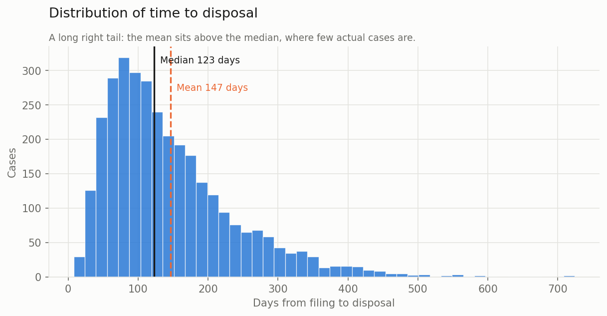
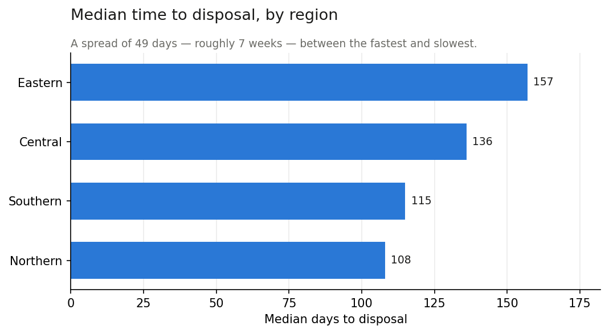
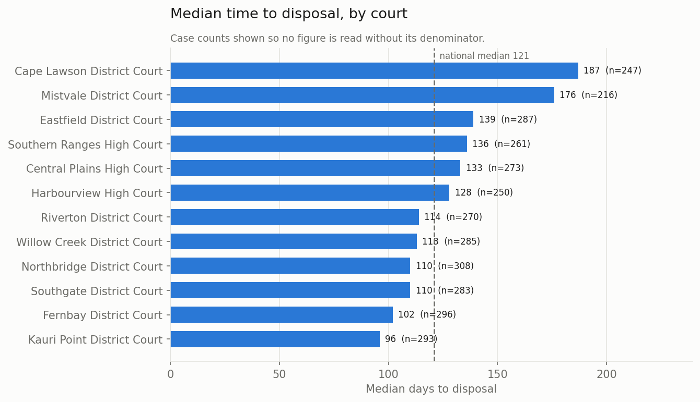
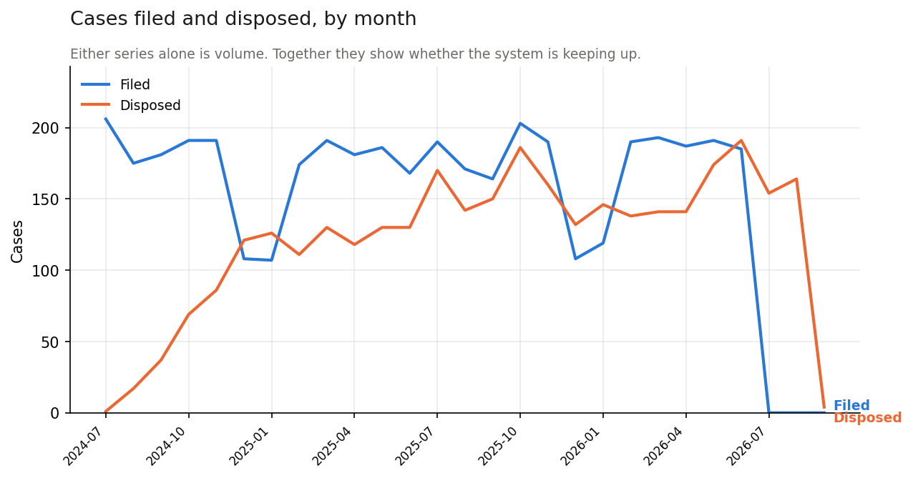
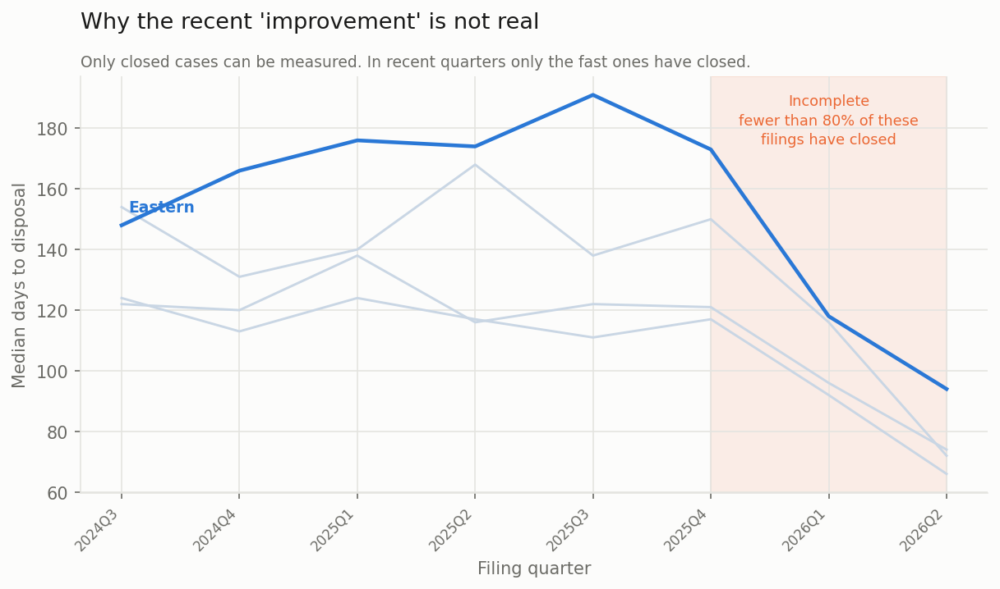
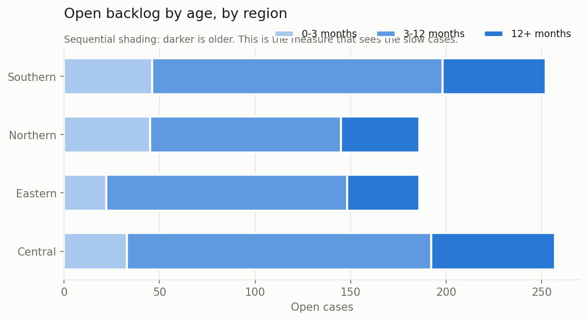

# Court Timeliness Monitor

**An end-to-end analytics pipeline on synthetic public-sector data - Python for
cleaning and analysis, Power BI for the reporting layer.**

> ⚠️ **The data in this repository is synthetic.** It was generated for practice
> and bears no relationship to any real court, dataset or published statistic.
> Court and region names are invented.

---

## The question

*"How long are cases taking, and is anywhere falling behind?"*

Deliberately vague, because that is how a reporting request usually arrives. Most
of the work is turning it into something answerable: deciding what "taking" means,
what the data can actually support, and what it cannot.

## Headline results

| | |
|---|---:|
| Cases in scope | 4,200 |
| Closed | 3,312 |
| Open | 888 |
| **Median days to disposal** | **123** |
| Mean days to disposal | 146 |
| Open longer than 365 days | 198 (22.3%) |
| Rows excluded as unusable | 50 |

The mean sits **23 days above
the median**. The distribution has a long right tail, so the mean describes a case
that mostly does not exist - every headline figure here is a median.



---

## Findings

### 1. Where you file changes how long you wait

Eastern has a median of **157 days** against
**108** in Northern - a gap of
**49 days, roughly 7 weeks**.



Two courts carry most of it. Cape Lawson District Court runs at a median of
**187 days** (n=247), well clear of the rest.



### 2. The backlog is growing

Filings exceeded disposals by **881 cases** across the period.
Reported together on purpose: either series alone is a volume figure, but the pair
answers whether the system is keeping up with what arrives.



### 3. The apparent recent improvement is a measurement artefact

This is the finding that mattered most.

Plotted by filing quarter, Eastern deteriorates steadily to
**191 days** at 2025Q3, then appears to improve sharply to
**94 days** by 2026Q2.

It has not improved. **Only closed cases can be measured**, and in recent quarters
only the fast ones have closed - the slow cases are still open and invisible to the
measure. The closure rate makes it explicit: **94%** of the
earliest quarter's filings have closed, against **21%** of the
most recent.



The pipeline computes that closure rate per quarter and flags any quarter below
80% as incomplete - **3 quarters** for
Eastern - rather than reporting an improvement that is not there.

The measure that *does* see the slow cases is the age profile of the open backlog,
which is why it is reported alongside:



---

## Data quality

The raw extract has **4,200 rows** and arrives in the state these files
usually arrive in. Every issue was decided on deliberately and logged:

| issue                                                                 |   rows_affected | decision                                                                        | reason                                                                           |
|:----------------------------------------------------------------------|----------------:|:--------------------------------------------------------------------------------|:---------------------------------------------------------------------------------|
| `case_type` had 21 distinct values                                    |              17 | Trimmed, title-cased and mapped variants -> 4 canonical values                  | Casing, whitespace and abbreviations only; no genuine category was merged        |
| `status` had 7 distinct values                                        |               5 | Trimmed, title-cased and mapped variants -> 2 canonical values                  | Casing, whitespace and abbreviations only; no genuine category was merged        |
| Duplicate case IDs                                                    |              38 | Kept the more complete record per case ID                                       | Pairs disagreed on status; the row with a disposal date is the later extract     |
| Rows where disposed before filed                                      |              18 | Flagged and excluded from analysis; retained in the file                        | Correcting silently would hide a source-system problem                           |
| Rows where filed in the future                                        |               5 | Flagged and excluded from analysis; retained in the file                        | Correcting silently would hide a source-system problem                           |
| Rows where court_id not in lookup                                     |              31 | Flagged and excluded from analysis; retained in the file                        | Correcting silently would hide a source-system problem                           |
| `reported_days` disagrees with the duration calculated from the dates |              47 | Quantified and flagged; the calculated duration is used for analysis            | Only findable by checking the source figure against an independent recomputation |
| Cases with no matching court in the lookup                            |              31 | Left join retained them; already flagged and excluded from court-level analysis | An anti-join finding worth reporting to the data owner, not deleting             |

### The reconciliation

The extract supplies a duration column from the source system. The duration can
also be derived independently from the filing and disposal dates. **For
29 cases in the analysis set the two disagree** (47 across the raw
extract, before duplicates and unusable rows are removed - see
`outputs/profile_report.md`).

That is only findable by checking one source against an independent one - the same
control an accountant applies when a ledger has to tie to a statement. Those rows
are quantified and flagged, not corrected: silently overwriting them would hide a
problem in the source system rather than surface it.

### What was excluded, and why

50 rows are flagged `quality_flag = True` and excluded from
analysis - impossible dates, and court IDs that do not exist in the lookup. They
remain in `cases_clean.csv` with a reason attached, so the exclusion is visible
rather than invisible.

### Small counts

Any figure resting on fewer than 5 cases is suppressed before
it is reported. In a small jurisdiction a cell of two or three can identify a
person. Real suppression is harder than this - where row totals are also published,
a reader can sometimes recover a suppressed cell by subtraction - but the principle
belongs in the pipeline rather than in a caveat nobody reads.

---

## Results by region

| region   |   closed |   median days |   mean days |   open |   overdue % |
|:---------|---------:|--------------:|------------:|-------:|------------:|
| Eastern  |      534 |           157 |         179 |    186 |        20.4 |
| Central  |      759 |           136 |         161 |    257 |        25.3 |
| Southern |     1125 |           115 |         133 |    252 |        21.4 |
| Northern |      851 |           108 |         131 |    186 |        22   |

---

## Running it

```bash
git clone https://github.com/<your-username>/court-timeliness-monitor.git
cd court-timeliness-monitor
pip install -r requirements.txt
python run_pipeline.py
```

Runs in a few seconds and rewrites everything in `data/processed/` and `outputs/`,
including this README. The pipeline is **deterministic** - the reporting date is
pinned in `src/config.py` rather than taken from `today()`, so re-running it next
month cannot silently change the results.

## Repository layout

```
court-timeliness-monitor/
├── run_pipeline.py            # runs all five stages in order
├── src/
│   ├── config.py              # paths, thresholds, palette - every tunable in one place
│   ├── profile_data.py        # stage 1: profile, change nothing
│   ├── clean_data.py          # stage 2: clean, flag, reconcile, merge
│   ├── analyse.py             # stage 3: reporting tables + the censoring check
│   ├── make_charts.py         # stage 4: figures
│   └── make_report.py         # stage 5: this README, from the results
├── data/
│   ├── raw/                   # synthetic source extract, never modified
│   └── processed/             # cleaned data, cleaning log, result tables
├── outputs/
│   ├── figures/               # PNGs
│   └── profile_report.md      # data quality profile
├── docs/
│   ├── data_dictionary.md
│   ├── methodology.md         # definitions and the judgement calls
│   └── findings.md
└── powerbi/
    └── README.md              # the reporting layer built on data/processed/
```

## Design decisions worth knowing

| Decision | Why |
|---|---|
| IDs read as text | `"007"` read as a number becomes `7`, and the join fails |
<<<<<<< HEAD
| Dates parsed day-first explicitly | The default parse corrupts only the 1st–12th of each month - much harder to spot than everything being wrong |
=======
| Dates parsed day-first explicitly | The default parse corrupts only the 1st-12th of each month - much harder to spot than everything being wrong |
>>>>>>> 7ba8a54 (Use hyphens not em-dashes in generated docs; clarify mismatch counts)
| A blank disposal date is kept blank | It means the case is open. Filling it would invent a disposal |
| Impossible rows flagged, not deleted | A silent fix hides a source-system problem |
| `validate="m:1"` on the merge | Turns a silent fan-out into an immediate error |
| Row count asserted either side of the merge | If it changed, the join key was not unique |
| Reporting date pinned, not `today()` | Otherwise the pipeline is not reproducible |
| Median everywhere, mean shown beside it | The distribution is skewed; the gap between them is itself a finding |
| Denominators shown next to every median | So nobody acts on a median of eleven cases |

## Stack

Python 3.11+ · pandas · matplotlib · Power BI Desktop

---

*Built by Kevin Nguyen - Bachelor of Commerce (Accounting and Business Analytics),
University of Auckland. Synthetic data; not affiliated with any government agency.*
